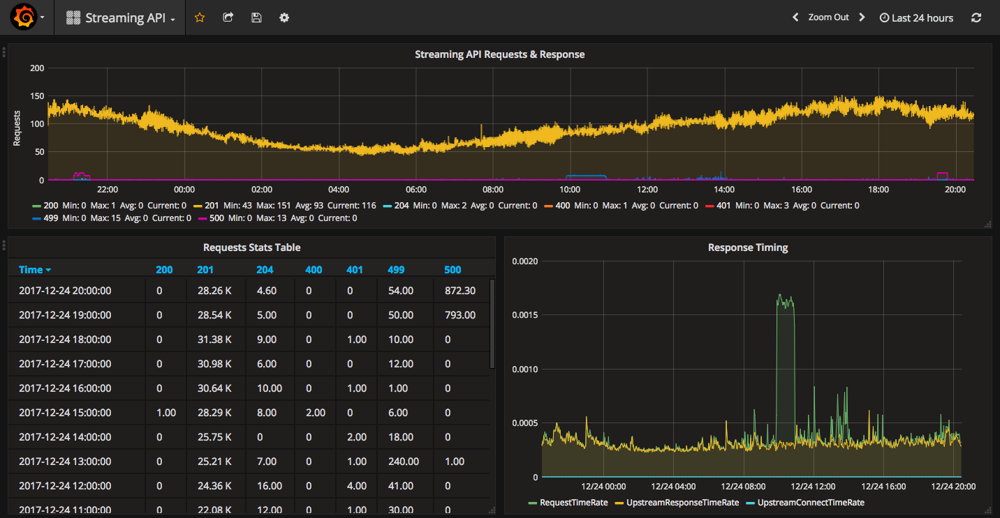

# nginx-clickhouse

[](https://x.com/intent/tweet?text=Simple%20NGINX%20logs%20parser%20and%20transporter%20to%20ClickHouse%20database.&url=https://github.com/mintance/nginx-clickhouse&hashtags=nginx,clickhouse,golang)
[](https://www.reddit.com/submit?url=https://github.com/mintance/nginx-clickhouse&title=nginx-clickhouse%20-%20NGINX%20logs%20to%20ClickHouse)

[](https://pkg.go.dev/github.com/mintance/nginx-clickhouse)
[](https://goreportcard.com/report/github.com/mintance/nginx-clickhouse)
[](https://github.com/mintance/nginx-clickhouse/actions/workflows/test.yml)
[](https://github.com/mintance/nginx-clickhouse/blob/master/LICENSE)
[](https://hub.docker.com/r/mintance/nginx-clickhouse/)
[](https://github.com/mintance/nginx-clickhouse/issues)

Simple NGINX access log parser and transporter to ClickHouse database. Uses the native TCP protocol for fast, compressed batch inserts.

## Features

- Tails NGINX access logs in real-time
- Configurable log format parsing via [gonx](https://github.com/satyrius/gonx)
- Batch inserts into ClickHouse using the [official Go client](https://github.com/ClickHouse/clickhouse-go) (native TCP, LZ4 compression)
- Prometheus metrics endpoint on `:2112`
- Configuration via YAML file or environment variables
- Minimal Docker image (scratch-based)

## Quick Start

### Using Docker

```sh
docker pull mintance/nginx-clickhouse

docker run --rm --net=host --name nginx-clickhouse \
  -v /var/log/nginx:/logs \
  -v /path/to/config:/config \
  -d mintance/nginx-clickhouse
```

### Build from Source

Requires Go 1.25+.

```sh
go build -o nginx-clickhouse .
./nginx-clickhouse -config_path=config/config.yml
```

### Build Docker Image

No local Go toolchain required -- builds inside Docker using multi-stage build.

```sh
make docker
```

## How It Works

1. Tails the NGINX access log file specified in configuration
2. Buffers incoming log lines in memory (up to `max_buffer_size`)
3. On a configurable interval (or when the buffer is full), parses the buffered lines using the NGINX log format
4. Batch-inserts parsed entries into ClickHouse via the native TCP protocol

## Configuration

Configuration is loaded from a YAML file (default: `config/config.yml`). All values can be overridden with environment variables.

### Environment Variables

| Variable | Description |
|---|---|
| `LOG_PATH` | Path to NGINX access log file |
| `FLUSH_INTERVAL` | Batch flush interval in seconds |
| `MAX_BUFFER_SIZE` | Max log lines to buffer before forcing a flush (default: `10000`) |
| `RETRY_MAX` | Max retry attempts on ClickHouse failure (default: `3`) |
| `RETRY_BACKOFF_INITIAL` | Initial retry backoff in seconds (default: `1`) |
| `RETRY_BACKOFF_MAX` | Maximum retry backoff in seconds (default: `30`) |
| `BUFFER_TYPE` | Buffer type: `memory` (default) or `disk` |
| `BUFFER_DISK_PATH` | Directory for disk buffer segments |
| `BUFFER_MAX_DISK_BYTES` | Max disk usage for buffer in bytes |
| `CIRCUIT_BREAKER_ENABLED` | Enable circuit breaker (`true`/`false`) |
| `CIRCUIT_BREAKER_THRESHOLD` | Consecutive failures before opening (default: `5`) |
| `CIRCUIT_BREAKER_COOLDOWN` | Seconds before half-open probe (default: `60`) |
| `CLICKHOUSE_HOST` | ClickHouse server hostname |
| `CLICKHOUSE_PORT` | ClickHouse native TCP port (default: `9000`) |
| `CLICKHOUSE_DB` | ClickHouse database name |
| `CLICKHOUSE_TABLE` | ClickHouse table name |
| `CLICKHOUSE_USER` | ClickHouse username |
| `CLICKHOUSE_PASSWORD` | ClickHouse password |
| `NGINX_LOG_TYPE` | NGINX log format name |
| `NGINX_LOG_FORMAT` | NGINX log format string |

### Full Config Example

See [`config-sample.yml`](config-sample.yml) for a ready-to-use template.

```yaml
settings:
  interval: 5                    # flush interval in seconds
  log_path: /var/log/nginx/access.log
  seek_from_end: false           # start reading from end of file
  max_buffer_size: 10000         # flush when buffer exceeds this (prevents memory issues)
  retry:
    max_retries: 3
    backoff_initial_secs: 1
    backoff_max_secs: 30
  buffer:
    type: memory                 # "memory" (default) or "disk"
    # disk_path: /var/lib/nginx-clickhouse/buffer
    # max_disk_bytes: 1073741824 # 1GB
  circuit_breaker:
    enabled: false
    threshold: 5
    cooldown_secs: 60

clickhouse:
  db: metrics
  table: nginx
  host: localhost
  port: 9000                     # native TCP port
  credentials:
    user: default
    password:
  columns:                       # ClickHouse column -> NGINX variable mapping
    RemoteAddr: remote_addr
    RemoteUser: remote_user
    TimeLocal: time_local
    Request: request
    Status: status
    BytesSent: bytes_sent
    HttpReferer: http_referer
    HttpUserAgent: http_user_agent

nginx:
  log_type: main
  log_format: '$remote_addr - $remote_user [$time_local] "$request" $status $bytes_sent "$http_referer" "$http_user_agent"'
```

## NGINX Setup

### 1. Define a Log Format

In `/etc/nginx/nginx.conf`:

```nginx
http {
    log_format main '$remote_addr - $remote_user [$time_local] "$request" $status $bytes_sent "$http_referer" "$http_user_agent"';
}
```

### 2. Enable Access Log

In your site config (`/etc/nginx/sites-enabled/my-site.conf`):

```nginx
server {
    access_log /var/log/nginx/my-site-access.log main;
}
```

## ClickHouse Setup

Create a table matching your column mapping:

```sql
CREATE TABLE metrics.nginx (
    RemoteAddr    String,
    RemoteUser    String,
    TimeLocal     DateTime,
    Date          Date DEFAULT toDate(TimeLocal),
    Request       String,
    Status        Int32,
    BytesSent     Int64,
    HttpReferer   String,
    HttpUserAgent String
) ENGINE = MergeTree()
ORDER BY (Status, TimeLocal)
```

## Prometheus Metrics

Available at `http://localhost:2112/metrics`:

| Metric | Description |
|---|---|
| `nginx_clickhouse_lines_processed_total` | Total log lines successfully saved |
| `nginx_clickhouse_lines_not_processed_total` | Total log lines that failed to save |
| `nginx_clickhouse_lines_read_total` | Total lines read from the log file |
| `nginx_clickhouse_parse_errors_total` | Total lines that failed to parse |
| `nginx_clickhouse_buffer_size` | Current number of lines in the buffer |
| `nginx_clickhouse_clickhouse_up` | Whether ClickHouse is reachable (1/0) |
| `nginx_clickhouse_flush_duration_seconds` | Time spent per flush (histogram) |
| `nginx_clickhouse_batch_size` | Number of entries per flush (histogram) |
| `nginx_clickhouse_circuit_breaker_state` | Circuit breaker state (0=closed, 1=open, 2=half-open) |
| `nginx_clickhouse_circuit_breaker_rejections_total` | Flushes rejected by circuit breaker |

## Reliability

### Retry with Backoff

When a ClickHouse write fails, the client retries with exponential backoff and full jitter. Configure via:

- `max_retries` — number of retry attempts (default: 3, set to 0 to disable)
- `backoff_initial_secs` — initial delay between retries (default: 1s)
- `backoff_max_secs` — maximum delay cap (default: 30s)

The backoff doubles each attempt with random jitter to avoid thundering herd.

### Connection Recovery

If the ClickHouse connection drops, it is automatically reset and re-established on the next retry attempt. No manual intervention needed.

### Graceful Shutdown

On `SIGTERM` or `SIGINT`, the service:
1. Flushes any remaining buffered log lines to ClickHouse
2. Closes the ClickHouse connection
3. Exits cleanly

This ensures no data loss during deployments or container restarts.

### Buffer Limits

The in-memory buffer is capped at `max_buffer_size` (default: 10,000 lines). When the buffer is full, it flushes immediately rather than waiting for the next interval.

### Disk Buffer

For crash recovery, enable disk-backed buffering:

```yaml
settings:
  buffer:
    type: disk
    disk_path: /var/lib/nginx-clickhouse/buffer
    max_disk_bytes: 1073741824  # 1GB
```

When enabled, log lines are written to append-only segment files on disk. If the process crashes, unprocessed segments are automatically replayed on restart. This provides at-least-once delivery.

Segment files are rotated at 10MB and deleted after successful flush.

### Circuit Breaker

When ClickHouse is down for extended periods, the circuit breaker prevents wasting resources on retries:

```yaml
settings:
  circuit_breaker:
    enabled: true
    threshold: 5        # open after 5 consecutive failures
    cooldown_secs: 60   # wait 60s before probing
```

States:
- **Closed** (normal): all flushes proceed
- **Open**: flushes are skipped, lines counted as not processed
- **Half-open**: after cooldown, one probe flush is attempted. Success closes the circuit; failure re-opens it.

Monitor via `nginx_clickhouse_circuit_breaker_state` (0=closed, 1=open, 2=half-open) and `nginx_clickhouse_circuit_breaker_rejections_total`.

### Health Check

`GET /healthz` on port 2112 returns:
- `200 OK` — ClickHouse connection is alive
- `503 Service Unavailable` — ClickHouse is unreachable

Use for Kubernetes liveness/readiness probes:

```yaml
livenessProbe:
  httpGet:
    path: /healthz
    port: 2112
  initialDelaySeconds: 10
  periodSeconds: 30
readinessProbe:
  httpGet:
    path: /healthz
    port: 2112
  initialDelaySeconds: 5
  periodSeconds: 10
```

## Grafana Dashboard

A pre-built Grafana dashboard is included in [`grafana/dashboard.json`](grafana/dashboard.json). Import it into Grafana to visualize your NGINX metrics.



## Contributing

See [CONTRIBUTING.md](CONTRIBUTING.md) for development setup, code style, and pull request guidelines.

## License

[Apache License 2.0](LICENSE)
